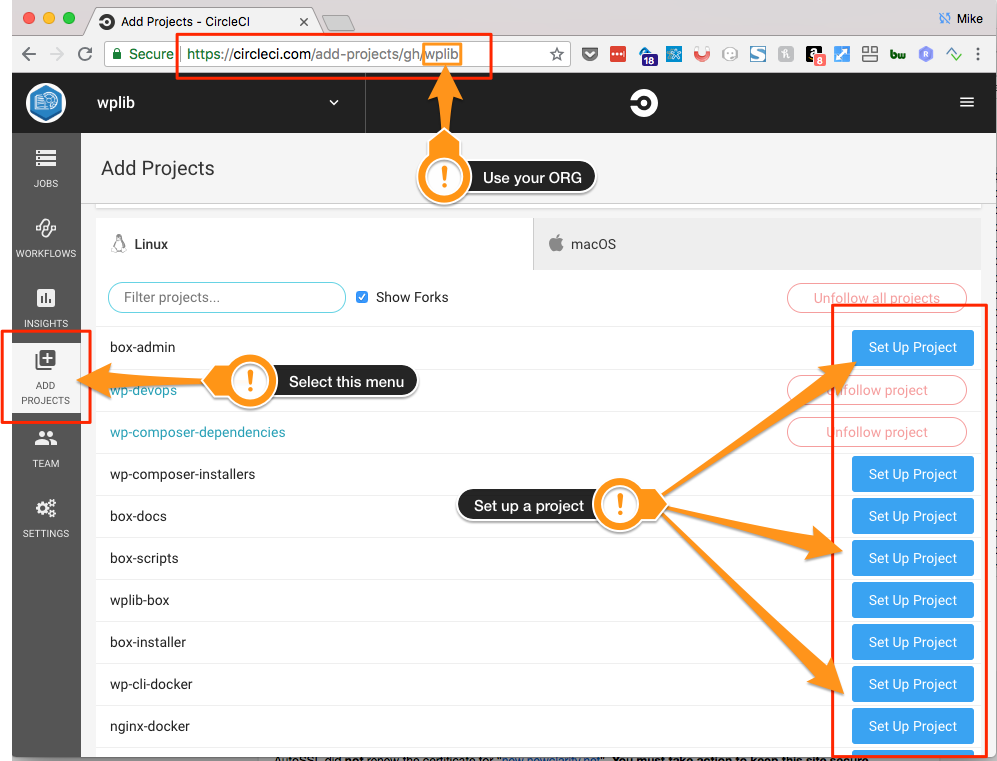
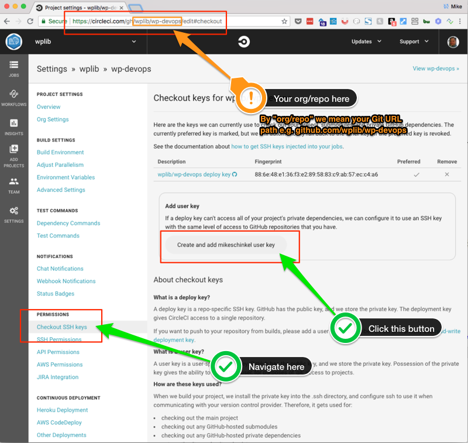
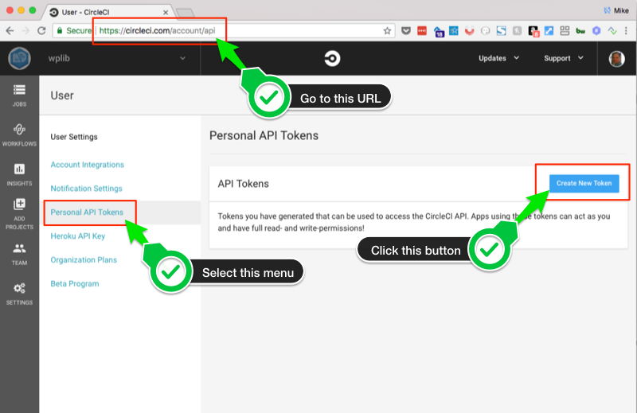
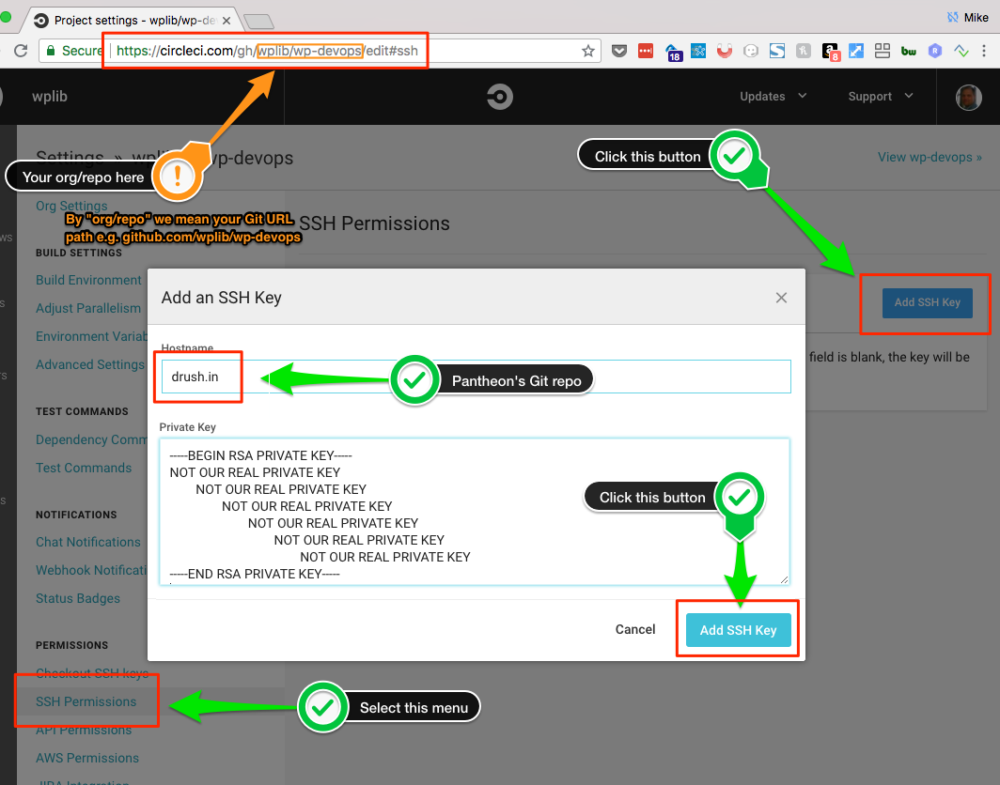
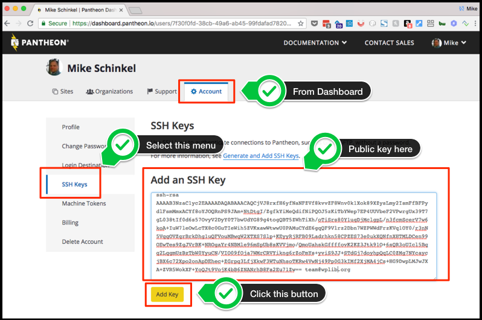

# WP DevOps

WP DevOps `2.1.0` is a Git-to-WebHost deployment solution for WordPress.  

It allows for building and deploying WordPress using [CircleCI 2.0](https://circleci.com/docs/2.0/) for continuous integration from a Git provider like [GitHub](https://github.com/) to [Pantheon](https://pantheon.io/) _(and soon [WPEngine](https://wpengine.com/))_ as web host(s).  

Of course WP DevOps supports [BitBucket](https://bitbucket.org/) and most any other Git provider too.

## Requirements
To use WP DevOps requires the following:
 
1. Version controlled in a **Git repository** at GitHub, BitBucket, GitLab or some other Git provider. 
    - This could also mean your own custom Git provider.
4. A project configured at [**CircleCI**](https://circleci.com) to enable builds whenever you push new commits to your Git repo . 
2. Dependency management with  [**Composer**](https://getcomposer.org) meaning a `composer.json` file in the Git repo's root directory. 
3. A **`project.json` file** in repo root containing your source code layout and info about your deployment hosts.   

## How To Use

1. Add the following values in the included sections to your project's `composer.json` file:

        {
            "repositories": [
                {
                    "type": "git",
                    "url": "https://github.com/wplib/wp-devops"
                }
            ],
            "require-dev": {
                "wplib/wp-composer-installers": "1.2"
            },
            "extra": {
                "installer-paths": {
                    ".circleci/wp-devops": [
                        "type:wordpress-devops",
                        "wplib/wp-devops"
                    ]
                }
            },
            "scripts": {
        		"pre-install-cmd": [
                    "php -r \"if ( ! is_dir('.circleci') ) { mkdir('.circleci'); }\""
                ],
                "pre-update-cmd": [
                    "php -r \"if ( ! is_dir('.circleci') ) { mkdir('.circleci'); }\""
                ],
                "post-install-cmd": [
                    "php -f '.circleci/wp-devops/init.php'"
                ],
                "post-update-cmd": [
                    "php -f '.circleci/wp-devops/init.php'"
                ]
            }
        }
    
      
 
2. Run `composer install` from your terminal command line in the root directory of your Git repository. 

        composer install --ignore-platform-reqs
        
    This will create a `.circleci` directory containing a `config.yml` and a `wp-devops` subdirectory contain the scripts from this Git repository.
    
    It will also create a `.gitignore` file and/or add the following entries:

        /.circleci/circleci.token
        /.circleci/wp-devops
        /.circleci/logs/*      

     _**Note:** `--ignore-platform-reqs` is not always needed but Composer fails if your local computer does not have all the required software to actually _host_ your project. In our option ignoring platform requirements should have been the default option and the Composer team should have added a `--require-platform-reqs` switch **instead**. But the Composer folks did not ask our opinion. :-)_
    
      
   
3. Add your project at CircleCI. You can do so at the URL that follows **after** you replace `ORG` with your own GitHub org slug: `https://circleci.com/add-projects/gh/ORG`.

    _**NOTE:** We use GitHub's `ORG` structure in our example as most projects use GitHub but other Git servers may use a different structure and so you will need to determine how CircleCI's URLs relate if you do not host your projects on GitHub. Or just use CircleCI's menus to navigate to the right place._

    
    
      

4. Add a user key that has permissions to write to your Git repository. You can do so at the URL that follows **after** you replace `ORG/REPO` with your own Git URL path: `https://circleci.com/gh/ORG/REPO/edit#checkout`.  

    _**NOTE:** We use GitHub's `ORG/REPO` structure in our example as most projects use GitHub but other Git servers may use a different structure and so you will need to determine how CircleCI's URLs relate if you do not host your projects on GitHub. Or just use CircleCI's menus to navigate to the right place._

    
    
      

5. Update the text file named `circleci.token` in your `.circleci` directory contain your own personal token which you can create at [circleci.com/account/api](https://circleci.com/account/api)  

    
    
      

6. Create an SSH key.  GitHub has a great [simple guide](https://help.github.com/articles/generating-a-new-ssh-key-and-adding-it-to-the-ssh-agent/) for how to create an SSH key.   

    _**NOTE:** We generally use something like `circleci-pantheon-PROJECT_NAME-your@email.address` when `ssh-keygen` asks for a name so we can use for this use only and not have to update other all services where we used one SSH key, assuming we ever a security issue with our private key._  
    
    _**NOTE:** However, using a unique name may require you to update your `~/.ssh/config` file and provide special configurations for it. Doing that is beyond the scope of these instructions, though._
    
      

7. Add the **private** file of the SSH key you just created to CircleCI. You can do so at the URL that follows **after** you replace `ORG/REPO` with your own Git URL path: `https://circleci.com/gh/wplib/wp-devops/edit#ssh`.  

    _**NOTE:** We use GitHub's `ORG/REPO` structure in our example as most projects use GitHub but other Git servers may use a different structure and so you will need to determine how CircleCI's URLs relate if you do not host your projects on GitHub. Or just use CircleCI's menus to navigate to the right place._

    _**NOTE:** The _private_ key is the file without an extension whereas the public key has an extension of `.pub`._    

    _**NOTE:** CircleCI needs the private key since it will need to act as a client to Pantheon's SSH server._    

    
    
      

8. Add the **public** version of your SSH key to the Pantheon dashboard:

    
    
      

9. Create a `project.json` or add to an existing one in your repo root and add the following, modifying it for your specific use-case:

        {
            "source": {
        		"web_root": "/www",
                "frameworks": {
                    "wordpress": {
                        "root_path": "/",
                        "core_path": "/wp",
                        "content_path": "/content",
                        "vendor_path": "/vendor"
                    }
                },
                "repository": {
                    "provider": "github",
                    "url": "ssh://git@github.com:ORG/REPO.git"
                }
            },
            "deploy": {
                "provider": "pantheon",
        		"web_root": "/",
                "site_id": "SITE_ID",
                "site_id:where_found": "SITE_ID is found in Pantheon dashboard URL for a site: https://dashboard.pantheon.io/sites/SITE_ID#dev/code",
                "site_name": "SITE_NAME",
                "site_name:where_found": "SITE_NAME is found in a Pantheon site's URL: http://dev-SITE_NAME.pantheonsites.io",
                "frameworks": {
                    "wp_devops": {
                        "ref_type": "tag",
                        "tag": "0.2.0"
                    },
                    "wordpress": {
                        "root_path": "/",
                        "core_path": "/",
                        "content_path": "/wp-content",
                        "vendor_path": "/vendor"
                    }
                },
                "files": {
                    "exclude": [
                        "{root}/index.php",
                        "{root}/wp-config.php",
                        "{root}/wp-config-atlpba.local.php",
                        "composer.json"
                    ],
                    "delete": [
                        "{root}/readme.html",
                        "{root}/README.md",
                        "{root}/xmlrpc.php",
                        "{root}/wp-trackback.php",
                        "{root}/wp-signup.php",
                        "{root}/license.txt",
                        "{root}/wp-config-sample.php",
                        "{content}/plugins/hello.php",
                        "{content}/themes/twentyseventeen/*",
                        "{content}/themes/twentyseventeen"
                    ],
                    "keep": [
                        "{content}/mu-plugins/pantheon.php",
                        "{content}/mu-plugins/pantheon",
                        "{content}/mu-plugins/index.php",
                        "{content}/plugins/index.php",
                        "{content}/themes/index.php",
                        "{content}/index.php"
                    ],
                    "copy": [
                        "{root}/pantheon.yml"
                    ]
                },
                "hosts": {
                    "develop": {
                        "branch": "develop"
                    },
                    "testing": {
                        "branch": "master"
                    },
                    "staging": {
                        "branch": "master",
                        "after": "deploy_dev_to_test"
                    },
                    "production": {
                        "branch": "master",
                        "after": "deploy_test_to_live",
                        "files": {
                            "delete": [
                                "/wp-config-local.php"
                            ]
                        }
                    }
                }
            },
            "hosts": {
                "production": {
                    "provider": "pantheon",
                    "name": "live",
                    "label": "Staging (Pantheon's 'LIVE')",
            		"web_root": "/code",
                    "repository": {
                        "url": "git clone ssh://codeserver.dev.SITE_ID@codeserver.dev.SITE_ID.drush.in:2222/~/repository.git",
                        "url:where_found": "GIT SSH clone URL from [Connection Info] button at top right in site's dashboard."
                    }
                },
                "staging": {
                    "provider": "pantheon",
                    "name": "test",
                    "label": "Staging (Pantheon's 'TEST')",
            		"web_root": "/code",
                    "repository": {
                        "url": "git clone ssh://codeserver.dev.SITE_ID@codeserver.dev.SITE_ID.drush.in:2222/~/repository.git",
                        "url:where_found": "GIT SSH clone URL: For Pantheon, this is the same URL from production above, for all hosts."
                    }
                },
                "testing": {
                    "provider": "pantheon",
                    "name": "dev",
                    "label": "Testing (Pantheon's 'DEV')",
            		"web_root": "/code",
                    "repository": {
                        "url": "git clone ssh://codeserver.dev.SITE_ID@codeserver.dev.SITE_ID.drush.in:2222/~/repository.git",
                        "url:where_found": "GIT SSH clone URL: For Pantheon, this is the same URL from staging above, for all hosts."
                    }
                },
                "develop": {
                    "provider": "pantheon",
                    "name": "develop",
                    "label": "Developer testing - Requires Multidev and is available for agencies and larger accounts",
            		"web_root": "/code",
                    "repository": {
                        "url": "git clone ssh://codeserver.dev.SITE_ID@codeserver.dev.SITE_ID.drush.in:2222/~/repository.git",
                        "url:where_found": "GIT SSH clone URL: For Pantheon, this is the same URL from testing above, for all hosts."
                    }
                },
            }
        
        } 
    
      

10. The last step should be to commit your changes and push, which should trigger a rebuild on CircleCI. You can find status on your builds at `https://circleci.com/gh/ORG/REPO`.

## Support
Any questions?  Just [**ask on Slack**](https://wplib.slack.com/).  

If you don't yet have access to our Slack account, you can [**join here**](http://launchpass.com/wplib).

## License

Copyright 2018 NewClarity Consulting, LLC

Licensed under the Apache License, Version 2.0 (the "License");
you may not use this file except in compliance with the License.
You may obtain a copy of the License at

    http://www.apache.org/licenses/LICENSE-2.0

Unless required by applicable law or agreed to in writing, software
distributed under the License is distributed on an "AS IS" BASIS,
WITHOUT WARRANTIES OR CONDITIONS OF ANY KIND, either express or implied.
See the License for the specific language governing permissions and
limitations under the License.

